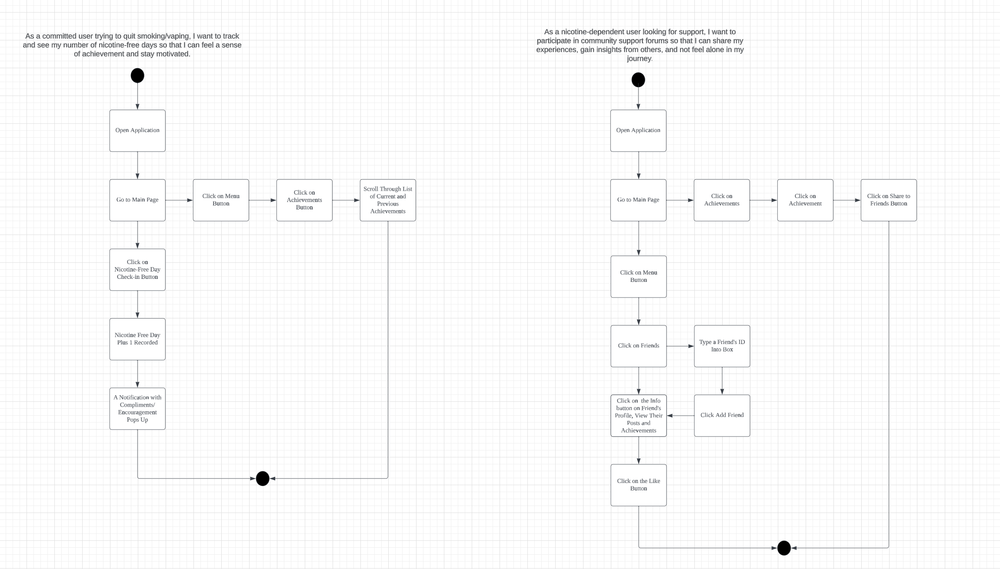
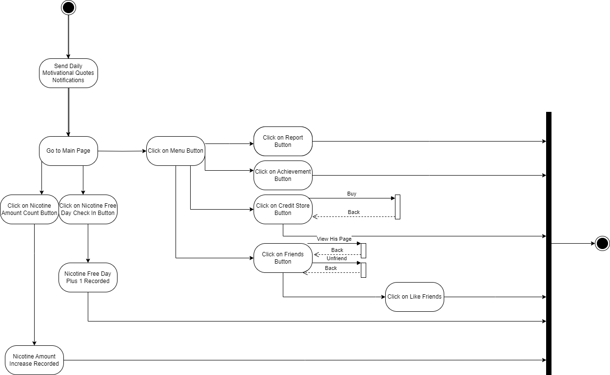
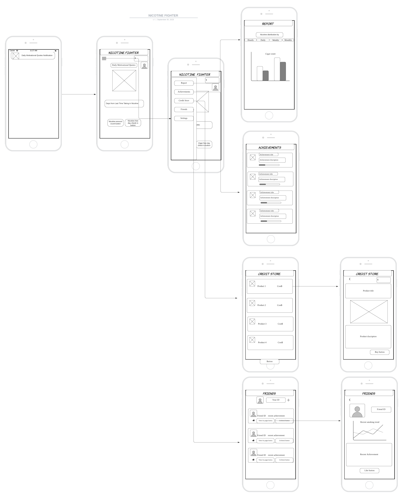

# Specification Phase Exercise

A little exercise to get started with the specification phase of the software development lifecycle. See the [instructions](instructions.md) for more detail.

## Team members
Lara Kim: https://github.com/larahynkim  
Kieren Gill: https://github.com/kierengill  
Andrew Huang: https://github.com/andrewhuanggg  
Chang Liu: https://github.com/cl5706  

## Ideation 
We plan to build a friendly and engaging mobile application designed for individuals determined to conquer their smoking or vaping habits. Adorned with an aesthetic of endearing icons and a user-friendly interface, this app will be visually pleasing and a supportive companion to those on their journey to a healthier lifestyle. At its core, the app will feature a real-time counter that celebrates the number of nicotine-free days, reinforcing the user's commitment and progress. As milestones are reached, users will earn in-app coins, turning their efforts into tangible rewards. Additionally, for those who need a more analytical approach, the app will offer a comprehensive consumption history tracker, allowing users to reflect on their consumption patterns and celebrate their achievements. Integrated motivational quotes, community support forums, and expert tips will further enhance the user experience, making this app not just a tool, but a heartwarming partner in achieving a nicotine-free life. 

## Stakeholders

### Stakeholder #1: Philip Choi  
Philip Choi is a 22-year-old recent graduate from New York University who has been grappling with nicotine addiction ever since he was a high school student. Although he started smoking out of curiosity and a desire to fit in with his friends, he has now grown a dependency to nicotine. He relies on nicotine in many ways, such as to calm his nerves or satisfy his cravings. His primary goal is to overcome this addiction and lead a healthier life.   
### Goals/Needs: 
1. Overcome a nicotine addiction and lead an overall healthier lifestyle, both mentally and physically. 
2. Understand an reflect on his nicotine consumption patterns and history.  
	i. Understand what drives him to indulge in nicotine, and uncover any noticable patterns.  
	ii. Keep track of these patterns in order to address them and prevent neglect.  
3. Receive recognition and rewards for milestones achieved, as well as motivation during the quitting process. 
4. Gain access to a supportive community or network that understands his struggles. 

### Problems/Frustrations:
1. A severe dependency on nicotine, relying on it as a solution or problem-solver to anxiety, cravings, boredom, and more. 
2. Experiencing frequent temptations, especially in social settings where peers might smoke or vape. 
3. Lack of a systematic way to track his progress, resulting in neglect or oblivion, as well as relapse. 
4. The occasional feeling of loneliness, the feeling of being alone in the journey.   
5. Not having a regular source of motivation or encouragement during difficult times. 

By understanding Philip's needs and frustrations struggling with nicotine addiction that many like him face, this app aims to provide him with the tools, community, and motivation he requires to successfully overcome his addiction and lead a healthier, nicotine-free life.

## Product Vision Statement

A digital companion empowering individuals on their journey to a healthier, nicotine-free life through insightful tracking, community support, and motivational rewards. 

## User Requirements

* As an easily demotivated nicotine-dependent user, I want to earn in-app coins for reaching milestones so that I can stay motivated, be rewarded for my efforts, and stay engaged with the app. 
* As a nicotine-dependent user currently trying to quit nicotine, I want to have access to expert tips and advice on quitting smoking/vaping so that I can be better informed and equipped to handle the challenges of quitting.
* As a struggling individual with specific goals to quit my addiction, I want to be able to customize my milestones so that I can work towards personal targets that are meaningful and motivating to me.
* As a committed user trying to quit smoking/vaping, I want to track and see my number of nicotine-free days so that I can feel a sense of achievement and stay motivated.
* As a nicotine-dependent user looking for support, I want to participate in community support forums so that I can share my experiences, gain insights from others, and not feel alone in my journey.
* As a nicotine-dependent user in need of motivation, I want to receive daily motivational quotes so that I can stay inspired and committed to quitting nicotine.
* As a perservering user who is proud of my progress, I want to be able to share my milestones and achievements to a community so that I can inspire others to quit and receive support from friends and family.
* As a data-oriented individual, I want to access a comprehensive consumption history tracker so that I can reflect on my consumption patterns and adjust my habits accordingly.
* As a user, I want to customize my real-time counter with different colors and themes so that it is more appealing for my personal aesthetic. 
* As a user experiencing cravings, I want to access distraction tools within the app so that I can overcome the urges to smoke or vape. 
* As a visual learner, I want to view my progress in the form of charts and graphs so that I can better understand my journey and progress over time. 

## UML Activity Diagrams
### User Story Activity Diagrams 

## General Activity Diagram 

## Wireframe Diagrams

## Clickable Prototype
[Clickable Prototype](https://www.figma.com/proto/8OcCgQFUwQruSJyB0u7IJx/SWE-Project-1?page-id=0%3A1&type=design&node-id=1-2&viewport=349%2C234%2C0.31&t=hFNplcxoskbgAaYB-1&scaling=scale-down&starting-point-node-id=1%3A2&mode=design)